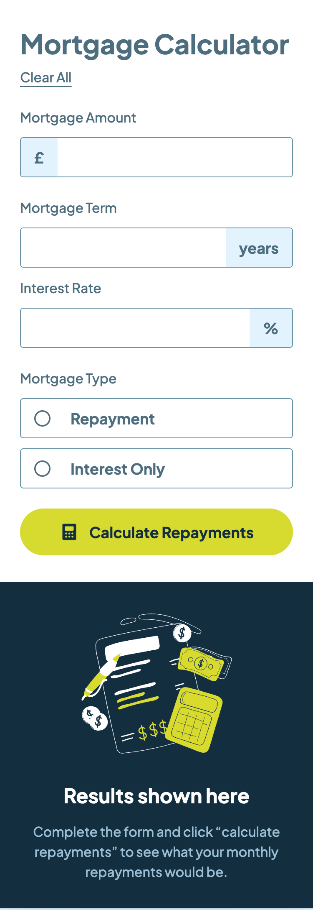
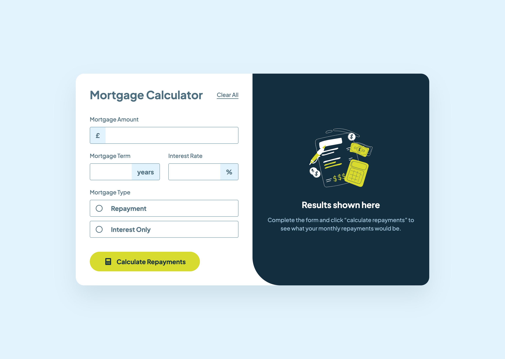
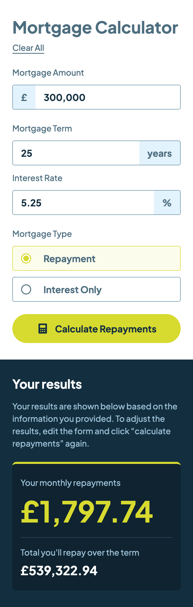
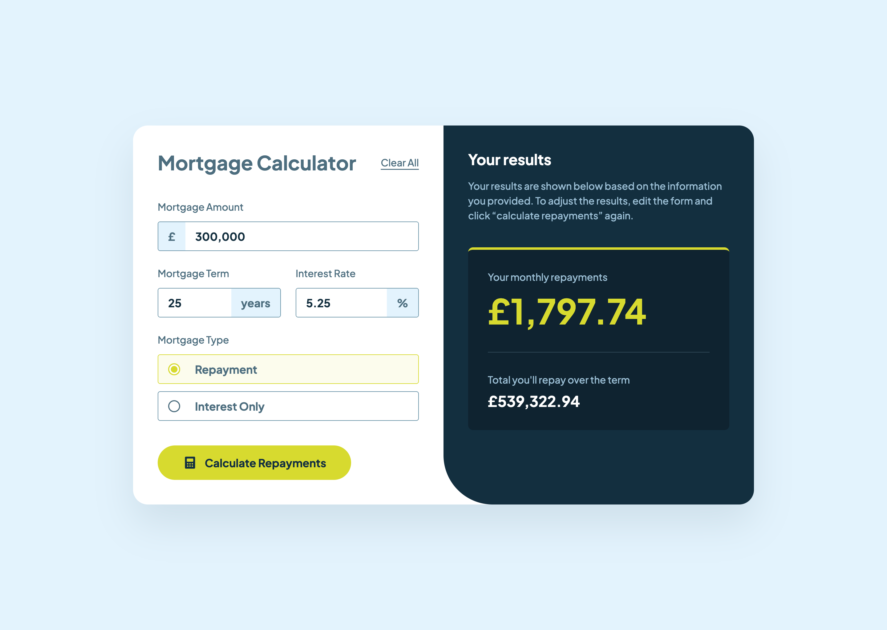
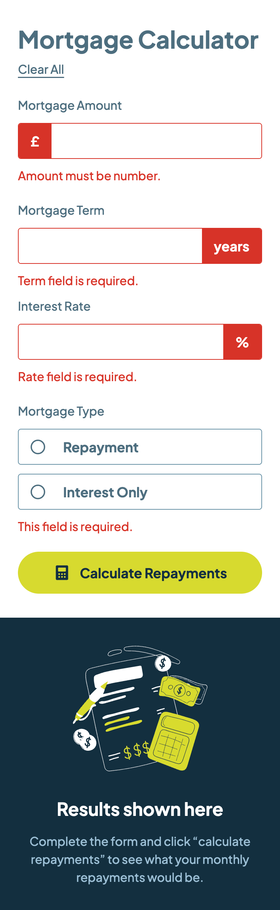
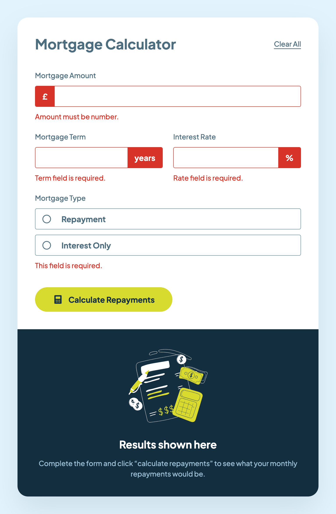
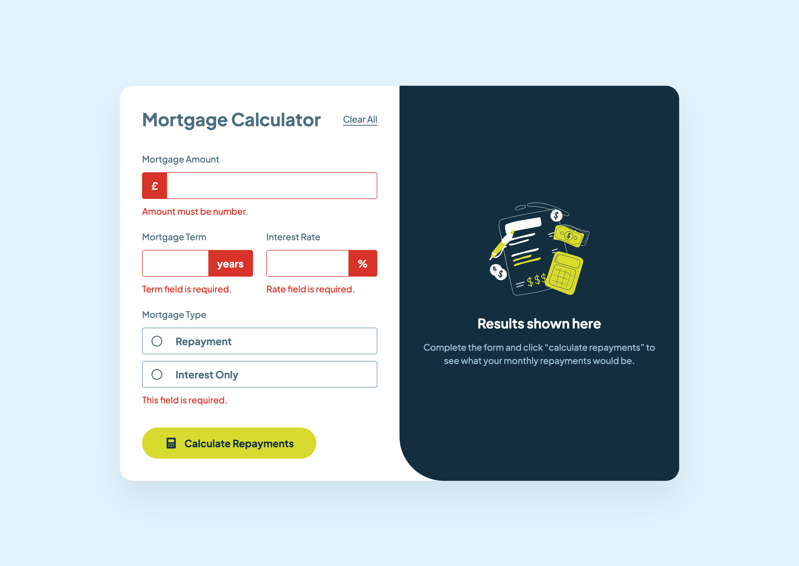

# Frontend Mentor - Mortgage repayment calculator solution

This is a solution to the [Mortgage repayment calculator challenge on Frontend Mentor](https://www.frontendmentor.io/challenges/mortgage-repayment-calculator-Galx1LXK73). Frontend Mentor challenges help you improve your coding skills by building realistic projects.

I completed this challenge as part of the [JavaScript frameworks and libraries](https://www.frontendmentor.io/learning-paths/javascript-frameworks-and-libraries-JDWoqQjMyb) Frontend Mentor learning path. This continues my efforts to learn my chosen JS Framework - [Vue.js](https://vuejs.org/) + [Pinia](https://pinia.vuejs.org/). And now the goal is to specifically learn to work with forms.

## Table of contents

- [Overview](#overview)
  - [The challenge](#the-challenge)
  - [Screenshots](#screenshots)
  - [Links](#links)
- [My process](#my-process)
  - [Built with](#built-with)
  - [What I learned](#what-i-learned)
  - [Continued development](#continued-development)
  - [Useful resources](#useful-resources)
- [Author](#author)

## Overview

### The challenge

Users should be able to:

- Input mortgage information and see monthly repayment and total repayment amounts after submitting the form
- See form validation messages if any field is incomplete
- Complete the form only using their keyboard
- View the optimal layout for the interface depending on their device's screen size
- See hover and focus states for all interactive elements on the page

### Screenshot

|             Mobile designed at 375px:              |             Tablet designed at 1440px:             | Desktop designed at 1440px:                         |
| :------------------------------------------------: | :------------------------------------------------: | --------------------------------------------------- |
|      |      |      |
|  |  |  |
|      |      |      |

### Links

- Solution URL: [https://github.com/elisilk/mortgage-repayment-calculator](https://github.com/elisilk/mortgage-repayment-calculator)
- Live Site URL: [https://elisilk.github.io/mortgage-repayment-calculator/](https://elisilk.github.io/mortgage-repayment-calculator/)

## My process

### Built with

- Semantic HTML5 markup
- CSS custom properties
- Flexbox
- CSS Grid
- Mobile-first workflow
- Accessibility
- [Vue](https://vuejs.org/)
- [Pinia](https://pinia.vuejs.org/)
- [Vite](https://vite.dev/)

### What I learned

As always, so many cool :sunglasses: things. Here are some of the key resources I used:

- Mortgage calculation formulas
  - [Calculator Soup Mortgage Calculator](https://www.calculatorsoup.com/calculators/financial/mortgage-calculator.php)
  - [Rows Mortgage Calculator](https://rows.com/calculators/mortgage-calculator)
  - [Rows Interest Only Mortgage Calculator](https://rows.com/calculators/interest-only-mortgage-calculator)
- [Vue](https://vuejs.org/)
  - [Quick Start](https://vuejs.org/guide/quick-start)
  - [Event Handling](https://vuejs.org/guide/essentials/event-handling)
  - [Form Input Bindings](https://vuejs.org/guide/essentials/forms.html)
  - [Component v-model](https://vuejs.org/guide/components/v-model)
- [Interactive Form Validation in Vue3](https://medium.com/@sj.anyway/interactive-form-validation-in-vue3-384643a02a27)
- [Pinia](https://pinia.vuejs.org/)
  - [State](https://pinia.vuejs.org/core-concepts/state.html)
  - [Getters](https://pinia.vuejs.org/core-concepts/getters.html)
  - [Todo App](https://play.pinia.vuejs.org/#eNqtVs1y2zYQfpU1L5QdmUzGbQ4cyWO3k86kh7STuKcwB4pcWohJgIMfWRqVb9IH6HP1SboA+Cu7nkzbiygQu99++Haxy2Nw2zTRzmCQBCuVS9ZoUKhNc51yVjdCajiCxBJaKKWoISTTcLKltJB4Jz5iqQaThnGWTY2MIpNCjBZRrO06+qrILOW54EqDe/XJ4sF6cFmc99tHKFmlUS67JxY95nrKYjHCkGvvzPHRWt/hXpM5nWcRhm67NDzXTHDICoe3OIdjygFYCYuziVe0yyqD3SYQgjaS3AFaiwIT8lGP9NTbGj55S3xCUoFwVrFPAElPC411U2UaaQWwqrINVtcrxhujYXdZiwKrdRp4KdIA9KFBWsusYIKWDpnWWVWlwTXcVtUq9hD/Ba2kxKotFhbyp+7//4Fr+BT5t2E1w95K/zR+baMxilEKSQhWfmB8XhoUIXnAQ7cdMYvuXcn5lKM3Uf2xRrL5FvOHjdhPnI9Hl+9I23JqKXMOMa6YZxh3FDs5/PYHfATLKumsT+NP6mKMbQPQ6oZO0UhUKkJOx7N59TXWcZrptDFaUz0nBVPZpsKCrKeFbOHyiuUPM5TbgsT2noSyiofiC5aBv8aXddbQfRWcGoW7BGm3QTIn/bVIA3f37Zs0iN3/CFV9uZHiUaEk/zRY9qY31EriAndaiEpdZg3zblutG5XEcV5wsidx2E5GHHXMmzp+4nPzNvo+ekPSb2IKFDNe4H4ehjwuC6y/Bb03vXkdvfkueutQd1cdaG1RuxvfkixaUWsp2f2JKLmoG1ah/KWxbWUuDt1G8fize6elwYGiK7Fn3n9VVHWW9a+UfJQ7nBxLZ/IeKZt2+92nDy6zwyYVlanI+oXNj6hEZSxHb/aD4QXRntg5tu9djhm/v1Pv9hq56g9liTo1nL2T+ccXjj7SvYqupip2c4AEHMZFgdQA0E+C05mSctw7M9/Xh8mynnotQgcbLn18pamSE6DWvr6GRUcpvriAG3vN3G0mhRKyk3TQJbAiAW7qjZ01Y0dIYENFhxmH9vOXFi5ij+MiJfD5S6fbBDckBUP4HcK+n7nF2OzCEcX3rQScS48UuzYAj6yqYIOQGS3qTLOcbA7U7EqU1OmIQEfWe5E++j2Rfe1Q2nP3IOkJnmh2h+8Z+BHr9BlGmwtsY9lKrtCm8gz++uPPftePPi9q5NPn2S/c6HUinzRTN/j6UgEYFXg+/rdEOHs5BGWhQ6NseDz17xLdw8wS9U/M7VeD3rKeL6zXNNyHdE8Mncg2kSD0lgy7BFGu9fZE/Kn2gzZdkImKvUkLWCl8nsmk9GZcpqAnyRlgT5LjbF1upsL738x9UY3VZuuJHyCrheEaRAnUC0xNo0wte7gMGrrmjIgLCVxo79h/SdmszevzIAzJx6FgEnNN16E2NhVEC33d9LYjz6gxarvwJeBT7/b8fXn1al4BZWZFbGdVZX/b86D9GztAvyY=)
- [Vue.js form reset](https://codepen.io/sandmanisdancing/pen/EmBbwR?editors=1010)
- [`output` HTML element](https://developer.mozilla.org/en-US/docs/Web/HTML/Reference/Elements/output)
- [Inclusively Hiding & Styling Checkboxes and Radio Buttons](https://www.sarasoueidan.com/blog/inclusively-hiding-and-styling-checkboxes-and-radio-buttons/)
  - [`box-shadow`](https://developer.mozilla.org/en-US/docs/Web/CSS/box-shadow)
  - [CSS Circles](https://cloudfour.com/thinks/css-circles/)
- [HTML Named character references](https://html.spec.whatwg.org/multipage/named-characters.html#named-character-references)
  - [Character reference](https://developer.mozilla.org/en-US/docs/Glossary/Character_reference)
- [`text-underline-offset`](https://developer.mozilla.org/en-US/docs/Web/CSS/text-underline-offset)
- [Everything You Ever Wanted to Know About `inputmode`](https://css-tricks.com/everything-you-ever-wanted-to-know-about-inputmode/)
- Cool effect of transforming the input number to include commas
  - [Maska](https://github.com/beholdr/maska)
  - [Vue Number Format](https://vue-number-format.netlify.app/)
  - [Remove commas from the string using JavaScript](https://stackoverflow.com/questions/5788741/remove-commas-from-the-string-using-javascript)
  - [Set keyboard caret position in html textbox](https://stackoverflow.com/questions/512528/set-keyboard-caret-position-in-html-textbox)
  - [vuejs add comma to numbers while typing](https://stackoverflow.com/questions/59766579/vuejs-add-comma-to-numbers-while-typing)
  - [JS Numbers and strings](https://developer.mozilla.org/en-US/docs/Web/JavaScript/Guide/Numbers_and_strings)
    - [How can I check if a string is a valid number?](https://stackoverflow.com/questions/175739/how-can-i-check-if-a-string-is-a-valid-number)
    - [JavaScript: Check if a String Is a Number (Explained Simply)](https://medium.com/@ryan_forrester_/javascript-check-if-a-string-is-a-number-explained-simply-d8aaa6189841)
  - [HTMLInputElement: `setSelectionRange()` method](https://developer.mozilla.org/en-US/docs/Web/API/HTMLInputElement/setSelectionRange)
  - [HTMLInputElement: `selectionStart` property](https://developer.mozilla.org/en-US/docs/Web/API/HTMLInputElement/selectionStart)

### Continued development

Specific areas that the solution should be improved (known issues):

- [ ] Add padding to the "clear all" button link so the hover/clickable area is larger, but taking into account that the flex container may or may not wrap and so the margin fixes could be either at the start or the end depending upon which position it is in. Maybe switch from a wrapping flex container to something more prescriptive (e.g., a container query that uses a two-column grid when there is enough inline space to do so)?

More general ideas I want to consider:

Hmm 🤔 ...

- Form frameworks for Vue
  - [FormKit](https://formkit.com/)
  - [VeeValidate](https://vee-validate.logaretm.com/)
    - [Abdelrahman Awad](https://awad.dev/)
    - [Abdelrahman Awad on GitHub](https://github.com/logaretm)
- [made with vue.js](https://madewithvuejs.com/) - Inspiration

### Useful resources

- [Vue Guide](https://vuejs.org/guide/)
- [Pinia Guide](https://pinia.vuejs.org/core-concepts/)
- [Vite Guide](https://vite.dev/guide/)
- [MDN Web Docs for CSS](https://developer.mozilla.org/en-US/docs/Web/CSS) - Went here a lot to reference the different CSS properties and the shorthands, and all the great explanations about best practices.

## Author

- Website - [Eli Silk](https://github.com/elisilk)
- Frontend Mentor - [@elisilk](https://www.frontendmentor.io/profile/elisilk)
